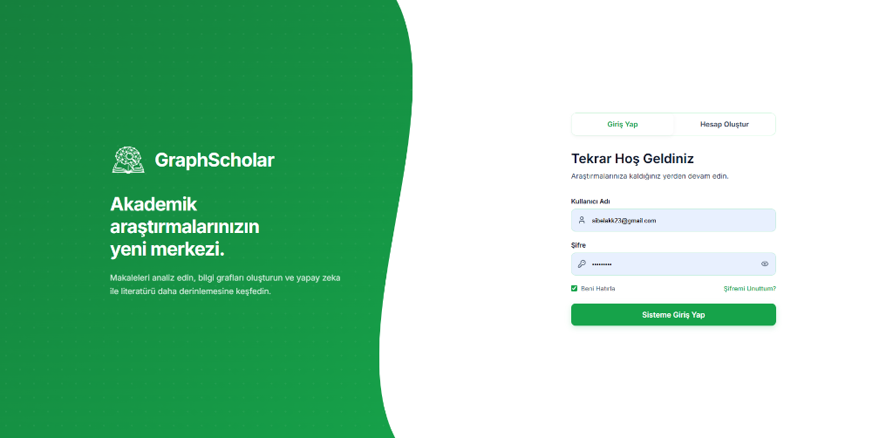
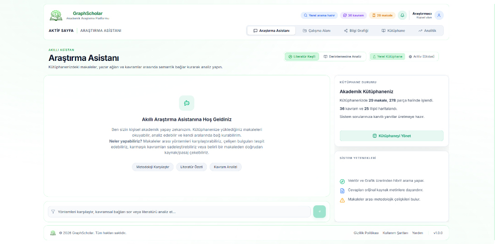
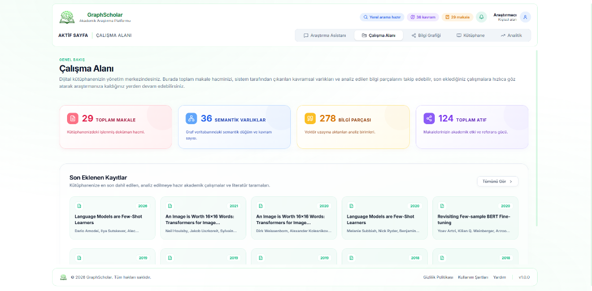
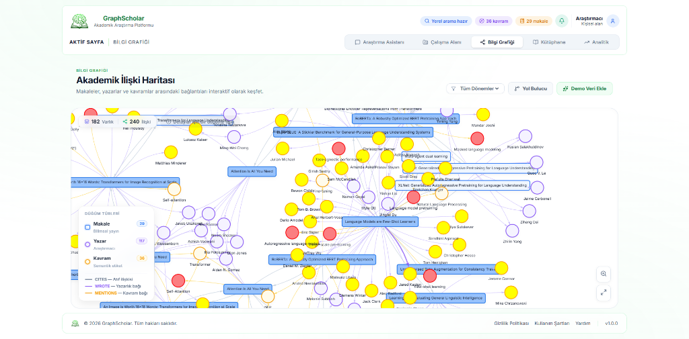
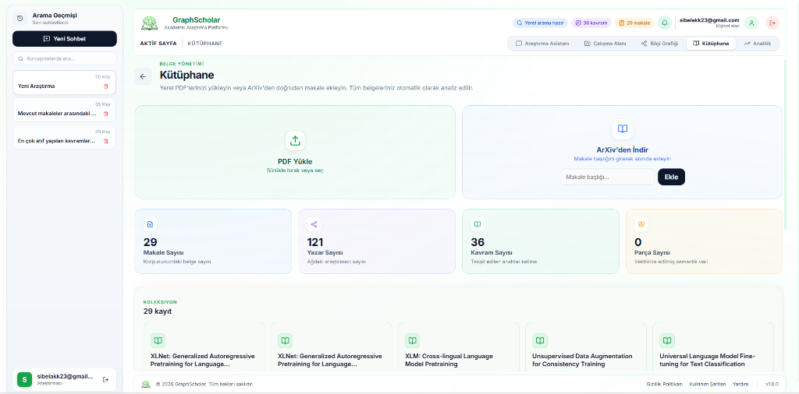
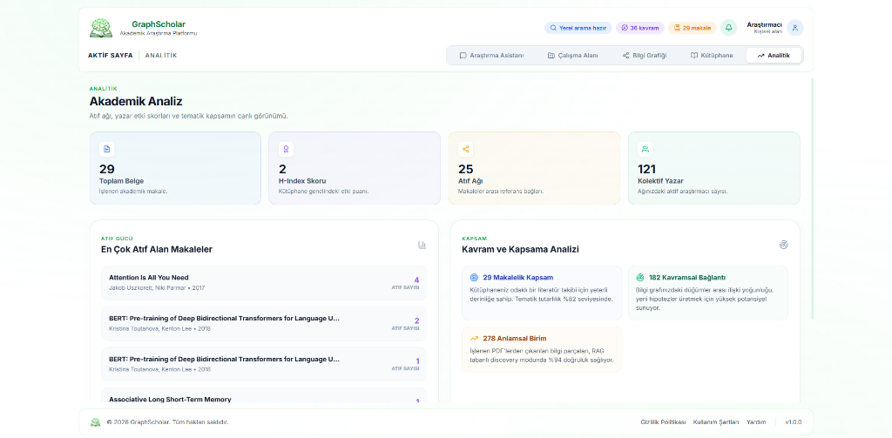

# GraphScholar

**Academic Research Platform — Hybrid RAG & Knowledge Graph**

GraphScholar is a full-stack academic research platform that combines vector-based semantic search (RAG) with a graph database (Neo4j) to enable deep analysis of scientific literature. Users can upload PDF papers or pull articles directly from ArXiv, then interact with their personal corpus through a conversational AI assistant, explore an interactive knowledge graph, and review citation analytics — all within a single, unified interface.

---

## Table of Contents

- [Overview](#overview)
- [Features](#features)
- [Application Screens](#application-screens)
- [Architecture](#architecture)
- [Technology Stack](#technology-stack)
- [Getting Started](#getting-started)
- [Environment Variables](#environment-variables)
- [API Reference](#api-reference)
- [Project Structure](#project-structure)

---

## Overview

GraphScholar solves a core problem in academic research: information is scattered across hundreds of PDFs, citations are difficult to trace, and finding conceptual connections between papers is time-consuming. The platform ingests academic documents, extracts structured metadata (authors, concepts, citations), vectorizes content for semantic retrieval, and maps relationships in a graph database. The result is a searchable, queryable, and navigable knowledge base built from the researcher's own document collection.

---

## Features

### Intelligent Research Assistant
- Conversational AI powered by Google Gemini with full context awareness of your document corpus
- Two search modes: **Literature Discovery** (broad thematic search) and **Deep Analysis** (precise document querying)
- Switchable sources: **Local Library** (private corpus) or **ArXiv** (global academic index)
- Source attribution — every answer is grounded in specific excerpts from source documents
- Contradiction detection between methodological claims across multiple papers

### Document Ingestion
- Drag-and-drop PDF upload with automatic processing pipeline
- Direct ArXiv integration — add papers by title, metadata fetched automatically
- Background author enrichment — author networks are built asynchronously without blocking the UI

### Knowledge Graph
- Interactive force-directed graph visualizing papers, authors, and concepts as nodes
- Edge types: CITES (citation relationship), WROTE (authorship), MENTIONS (concept reference)
- Filter by time period, search by entity, and pathfinding between any two nodes
- Node statistics panel with real-time counts of vertices and edges

### Library Management
- Personal document collection with chronological ordering (newest first)
- Client-side pagination for scalable browsing
- KPI dashboard: total documents, author count, concept count, and chunk count
- Per-paper display: title, authors, year, and citation count (only shown when data is available)

### Analytics Dashboard
- H-Index estimation based on the collected corpus
- Citation network strength — total inter-paper reference edges
- Most-cited papers ranked by citation count with author and year attribution
- Concept and coverage analysis: semantic unit counts, graph density signals, and RAG accuracy indicators

---

## Application Screens

### Authentication

A secure login interface where users authenticate before accessing their workspace. Built with a modern split-panel design featuring the platform's value proposition on the left and a minimalist, intuitive login form on the right.



### Research Assistant

The primary interface for interacting with the corpus. The left panel contains the conversational chat area with separate message history and input containers. The right panel displays live library statistics (document count, chunk count, concept count, citation edges) and a system capabilities reference.



### Workspace

The command center for the corpus. Displays four color-coded KPI cards (Total Documents, Semantic Entities, Knowledge Chunks, Total Citations) and a scrollable grid of the most recently added papers with author and year metadata.



### Knowledge Graph

A full-canvas, interactive graph rendered using a force-directed layout. Papers are displayed as labeled rectangles; authors and concepts appear as color-coded circular nodes. The legend, filter controls, and a minimap allow precise navigation across large graphs.



### Library

Split-panel hero section with a PDF upload dropzone (green theme) alongside an ArXiv ingestion form (blue theme). Below, a four-column KPI grid and a paginated paper collection grid sorted newest-first.



### Analytics

Four-column metric grid (Total Documents, H-Index Score, Citation Network, Collective Authors) followed by two analysis panels: a ranked list of the most-cited papers and a qualitative coverage analysis with graph density and RAG accuracy signals.



---

## Architecture

```
┌─────────────────────────────────────────────────────┐
│                   React Frontend                    │
│  Vite + React Router + Lucide Icons + MarkdownIt    │
└────────────────────┬────────────────────────────────┘
                     │ HTTP (REST)
                     ▼
┌─────────────────────────────────────────────────────┐
│                 FastAPI Backend                     │
│  PDF Processor  |  LLM Service  |  Search Service   │
│  Graph Service  |  Vector Service | ArXiv Service   │
└──────────┬──────────────────────────┬───────────────┘
           │                          │
           ▼                          ▼
┌──────────────────┐       ┌──────────────────────────┐
│     Neo4j        │       │        ChromaDB           │
│  Knowledge Graph │       │   Vector Store (RAG)      │
│  (Relationships) │       │  (Semantic Embeddings)    │
└──────────────────┘       └──────────────────────────┘
```

The backend performs a **hybrid search** on every query: ChromaDB handles vector similarity retrieval (dense search), while Neo4j traverses citation and authorship relationships (graph search). Results are merged and passed to Gemini for grounded answer generation.

---

## Technology Stack

| Layer | Technology |
|---|---|
| Frontend Framework | React 18 with Vite |
| Routing | React Router v6 |
| Styling | Vanilla CSS with CSS custom properties |
| Icons | Lucide React |
| Markdown Rendering | markdown-it |
| Backend Framework | FastAPI |
| LLM Provider | Google Gemini (via langchain-google-genai) |
| Graph Database | Neo4j 5.12 (Community Edition) |
| Vector Database | ChromaDB 0.4.24 |
| PDF Parsing | PyPDF |
| ArXiv Integration | arxiv Python library |
| Containerization | Docker + Docker Compose |

---

## Getting Started

GraphScholar runs via **Docker Compose**. The entire backend stack (FastAPI, Neo4j, ChromaDB) is containerized and orchestrated with a single command. The frontend development server runs separately with Node.js.

### Prerequisites

- [Docker Desktop](https://www.docker.com/products/docker-desktop/) (includes Docker Compose)
- A Google Gemini API key
- Node.js 18+ (for the frontend)

### 1. Clone the repository

```bash
git clone https://github.com/your-username/GraphScholar.git
cd GraphScholar
```

### 2. Configure environment variables

Create a `.env` file in the project root:

```bash
cp .env.example .env
```

Then open `.env` and fill in your credentials (see the [Environment Variables](#environment-variables) section for all required fields).

### 3. Start all backend services with Docker Compose

```bash
docker-compose up -d
```

Docker Compose will build and start three containers:

| Container | Service | Port |
|---|---|---|
| `graphscholar-neo4j` | Neo4j Graph Database | `7474` (browser UI), `7687` (bolt) |
| `graphscholar-chroma` | ChromaDB Vector Store | `8000` |
| `graphscholar-api` | FastAPI Backend | `8080` |

Wait a few seconds for Neo4j to initialize. You can verify all services are running with:

```bash
docker-compose ps
```

To tail the API logs:

```bash
docker-compose logs -f app
```

### 4. Start the frontend

```bash
cd frontend
npm install
npm run dev
```

The application will be available at `http://localhost:5173`.

### Stopping the services

```bash
docker-compose down
```

To also remove the persisted database volumes:

```bash
docker-compose down -v
```

---

## Environment Variables

Create a `.env` file in the project root with the following variables:

```env
# Google Gemini
GEMINI_API_KEY=your_gemini_api_key_here

# Neo4j
NEO4J_URI=bolt://localhost:7687
NEO4J_USER=neo4j
NEO4J_PASSWORD=your_neo4j_password

# ChromaDB
CHROMA_HOST=localhost
CHROMA_PORT=8000
```

When running with Docker Compose, replace `localhost` with the service names (`neo4j`, `chromadb`) as defined in `docker-compose.yml`.

---

## API Reference

| Method | Endpoint | Description |
|---|---|---|
| `POST` | `/analyze-pdf` | Upload and process a PDF file |
| `POST` | `/add-from-arxiv` | Add a paper by ArXiv title |
| `POST` | `/chat` | Send a message to the research assistant |
| `GET` | `/papers` | Retrieve all papers in the library |
| `GET` | `/graph` | Retrieve graph nodes and edges |
| `GET` | `/library/overview` | Get library statistics (KPI data) |
| `POST` | `/enrich-authors` | Trigger background author enrichment |

---

## Project Structure

```
GraphScholar/
├── app/                        # FastAPI backend
│   ├── main.py                 # Application entry point and route definitions
│   ├── database.py             # Neo4j connection management
│   └── services/
│       ├── pdf_processor.py    # PDF ingestion and chunking
│       ├── llm_service.py      # Gemini integration and prompt construction
│       ├── graph_service.py    # Neo4j query layer
│       ├── vector_service.py   # ChromaDB embedding and retrieval
│       ├── search_service.py   # Hybrid RAG search orchestration
│       └── arxiv_service.py    # ArXiv metadata fetching
├── frontend/                   # React + Vite frontend
│   └── src/
│       ├── App.jsx             # Root component and routing
│       ├── index.css           # Global design system and component styles
│       └── components/
│           ├── Topbar.jsx      # Navigation header
│           ├── ChatView.jsx    # Research assistant interface
│           ├── WorkspaceView.jsx # Dashboard and corpus overview
│           ├── GraphView.jsx   # Interactive knowledge graph
│           ├── LibraryView.jsx # Document management and ingestion
│           └── AnalyticsView.jsx # Citation and coverage analytics
├── data/                       # Persisted database volumes (Docker)
├── uploads/                    # Temporary PDF upload storage
├── docker-compose.yml          # Multi-service container configuration
├── Dockerfile                  # Backend container build definition
└── requirements.txt            # Python dependencies
```

---

## License

All rights reserved. This software and its source code are proprietary. Unauthorized copying, distribution, or modification is strictly prohibited.

&copy; 2026 GraphScholar
